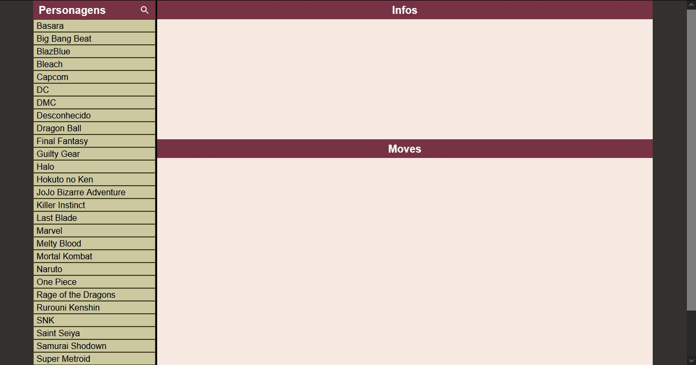
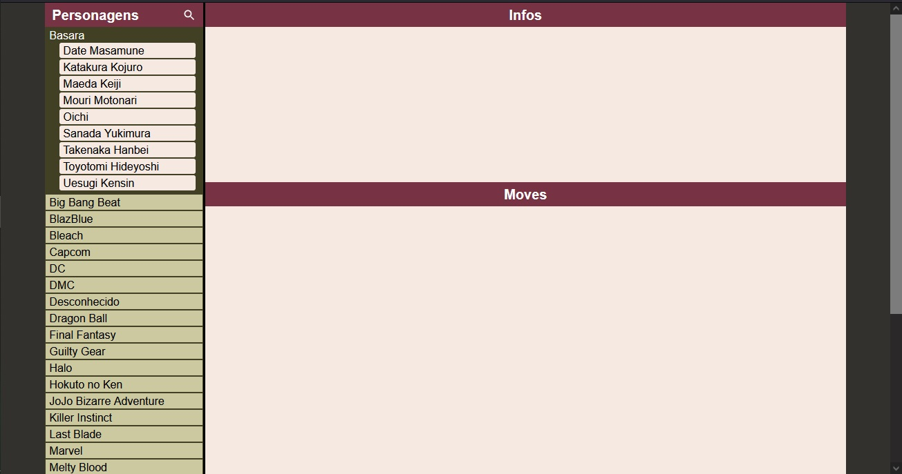
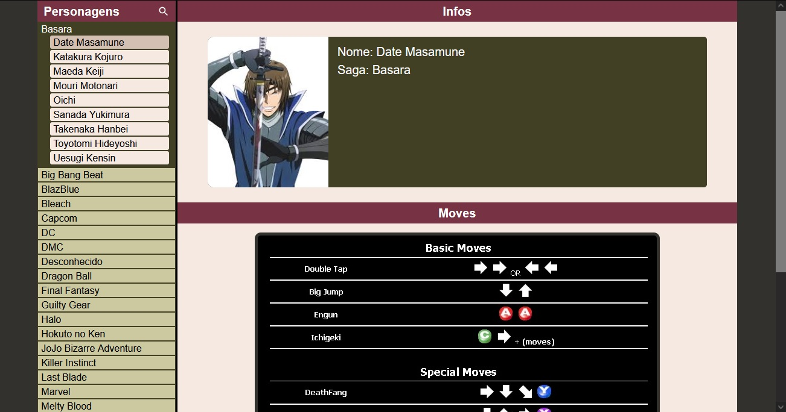
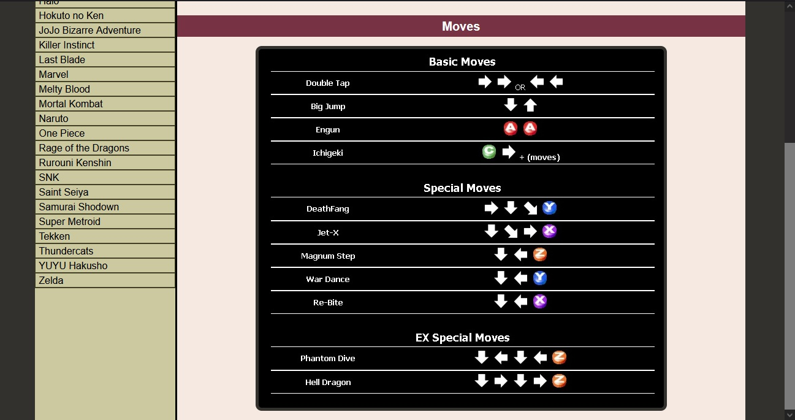
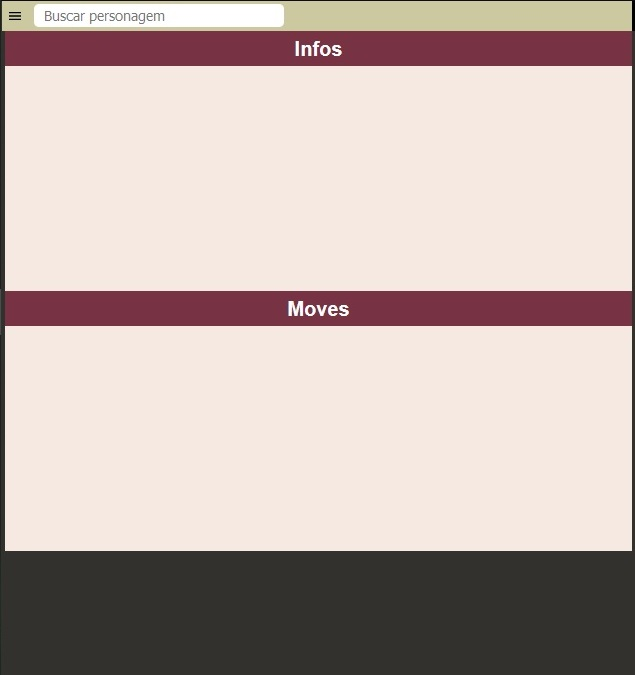
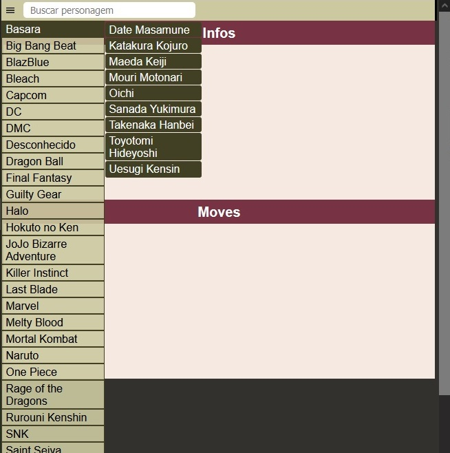
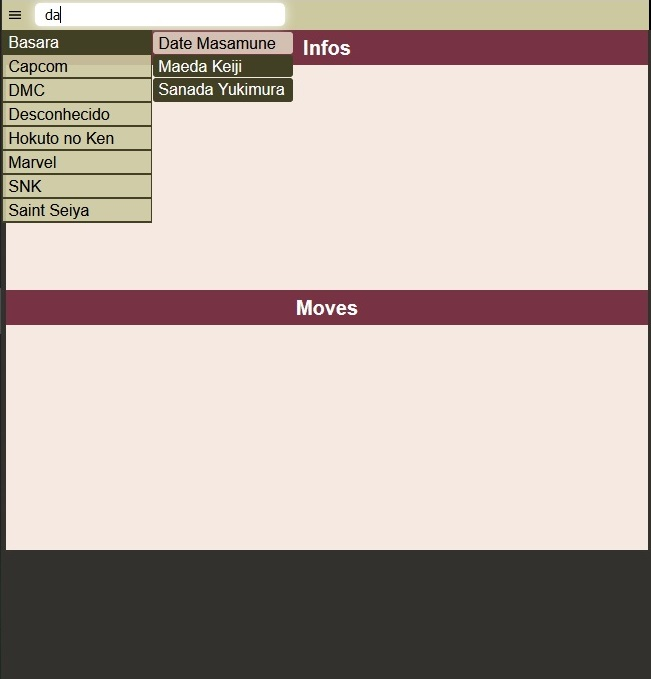
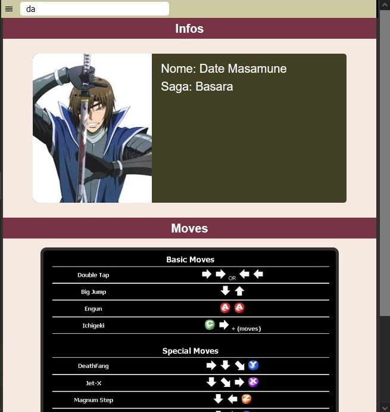
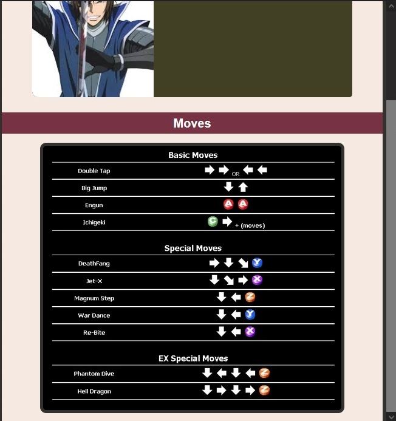

# Personal Mugen DB

Um database simples com personagens de mugen que acumulei durante os anos.

## Preview

### Home

---

### Menu Overview

---

### Character Selected

---

### Move List

---

### Home Page - Responsive Overview

---

### Menu - Responsive Overview

---

### Search Field

---

### Character Selected - Responsive Overview

---

### Move List - Responsive Overview

---

## Tecnologias usadas

- ReactJS
- Styled-Componts

---

## Instalação

### `yarn` || `yarn install`

Instala as dependências necessárias do projeto.

### `yarn start`

Inicia o projeto.

---

## Authors

Myself.
